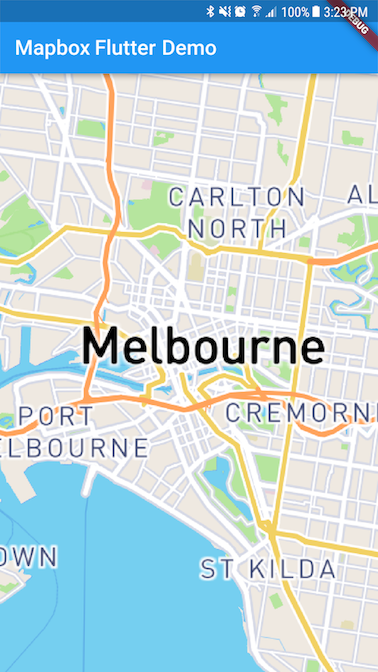

# Flutter Mapbox GL

> **Please note that this project is community driven and is not an official Mapbox product.** 
> 
> We welcome [feedback](https://github.com/tobrun/flutter-mapbox-gl/issues) and contributions.


## Introduction

Este complemento de Flutter permite mostrar mapas vectoriales integrados interactivos y personalizables dentro de un widget de Flutter. Para la integración de Android e iOS, usamos mapbox-gl-native. Para la web, confiamos en mapbox-gl-js. Este proyecto solo admite un subconjunto de la API expuesta por estas bibliotecas.




## Setting up

This package is available on [pub.dev](https://pub.dev/packages/mapbox_gl).

Get it by running the following command:

```
flutter pub get
```
```
flutter flutter run --dart-define ACCESS_TOKEN=YOUR_TOKEN_HERE
```
